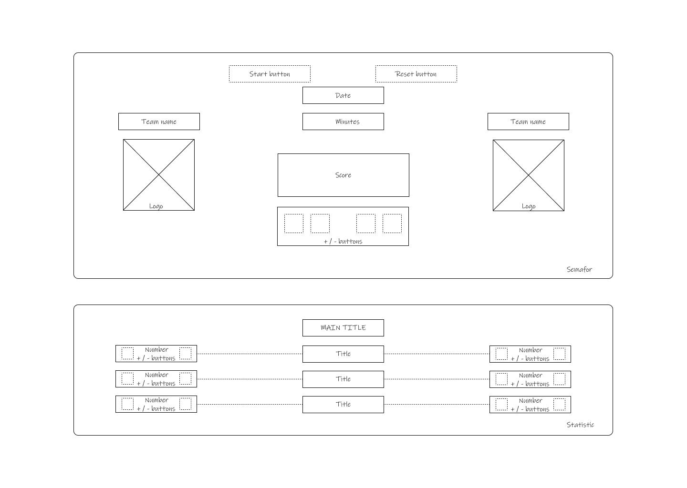

# Scoreboard

As part of my participation in the DD Junior Dev training program, I've developed this project to enhance and refine my IT skills.

---

### Table of content

- [Description](#item-one)
- [Features](#item-two)
- [Design](#item-three)
- [Instalation](#item-four)
- [Technologies](#item-five)

<a id="item-one"></a>

## Description

After becoming acquainted with state variables, let's employ the knowledge gained in a practical scenario.
The goal is create an application that serves as a traffic light for a football match.

<a id="item-two"></a>

## Features

The application should have the following functionalities:

- Display teams (logo and team name) 🏟️
- Current score ⚽
- Date 📅
- Controls to adjust the score 🎮

Additional functionalities:

- Minute counter (real-time or with control buttons) ⏱️
- Display of score changes (1:0 - 6' min; 1:1 - 32' min; ...) 🔄
- Framework for tracking statistics (shots, fouls, cards) with buttons to change values 📊
- Button to reset all values 🔁

<a id="item-three"></a>

### Design

<a id="item-four"></a>



### Instalation

In the project directory, you can run:

```bash
git clone -b task-2-scoreboard git@github.com:srudic/DD-JUNIOR-Dev-React.git
cd DD-JUNIOR-Dev-React
npm install
npm run dev
```

After running these commands, you should be able to access the project locally at [localhost:port] in your web browser.

<a id="item-five"></a>

## Technologies

This project makes use of various technologies and libraries to bring its features to life. Here's a rundown of the key technologies used:

- **React** ⚛️
- **React DOM** ⚛️
- **Vite** 🚀

_React + Vite_ - This combination provides a powerful toolset for fast and efficient development. Vite is a blazing fast build tool that pairs perfectly with React, offering features like Hot Module Replacement (HMR) for seamless development experience.
